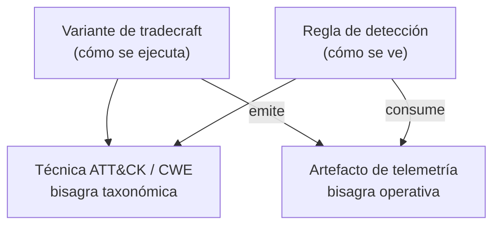

# Estructura del vault

Vault único **rojo + azul**. No hay carpetas `red/` ni `blue/`: los tipos de nota ya cubren ambos lados y la fusión ocurre en dos bisagras.

## Las dos bisagras

- **Bisagra taxonómica** — `500-tecnicas/`. Agrupa. No es accionable por sí sola: es una etiqueta compartida.
- **Bisagra operativa** — `550-telemetria/`. Es la que hace que los dos lados sean **una sola cosa**. Rojo pregunta *¿qué emite esta variante?*; azul pregunta *¿qué consume esta regla?* Ambas apuntan a la misma nota.

Si solo se enlaza por técnica, el vault es dos vaults con una etiqueta común.

## Carpetas

| Carpeta | Contenido | Unidad atómica |
|---|---|---|
| `000-inbox/` | Captura cruda sin procesar. Se vacía, no se acumula. | — |
| `100-notas/` | Zettels conceptuales: cómo funciona X, por qué falla Y. Agnósticos de bando. | Una idea |
| `200-fuentes/` | Papers, writeups, charlas, código de terceros. Literatura, no conocimiento. | Una fuente |
| `300-mapas/` | MOCs por dominio. **Árboles de decisión**, no listas de enlaces. | Un dominio |
| `400-entidades/` | Actores, malware, herramientas. | Una entidad |
| `450-superficies/` | Tecnologías objetivo: AD, Entra ID, Citrix, K8s, Jamf. Puerta de entrada de la cadena roja. | Una tecnología |
| `500-tecnicas/` | ATT&CK, CWE, WSTG. Nota paraguas, **sin contenido operativo**. | Un ID de taxonomía |
| `550-telemetria/` | Un artefacto por nota: qué lo genera, qué campos trae, cuánto cuesta, si viene activado por defecto. | Un artefacto |
| `600-tradecraft/` | Lado rojo. Técnica + implementación concreta + perfil OPSEC en un contexto dado. | Una variante |
| `650-detecciones/` | Lado azul. Lógica, fidelidad, falsos positivos, estado. | Una regla |
| `700-procedimientos/` | Runbooks y metodología. Cómo se hace algo de punta a punta. | Un procedimiento |
| `750-hallazgos/` | Biblioteca de findings reutilizables para informes: severidad, CVSS, descripción y remediación ya redactadas. | Un hallazgo |
| `900-meta/` | Administración del vault + matrices de referencia pura. | — |
| `999-plantillas/` | Plantillas de cada tipo de nota. | — |

## Lo que NO vive acá

- **Datos de engagement.** Vault aparte, cifrado, sin excepciones: hostnames, credenciales, evidencia, capturas de cliente. Ruta prevista: `~/hacking/obsidian/Engagements/` (vault propio, nunca sincronizado con este). El engagement es literatura fugaz; lo que sobrevive es el zettel destilado de él.
- **Detecciones propietarias de un empleador.** Son de la organización, no tuyas.
- **Payloads y snippets.** Van a la matriz de referencia (`900-meta/`) o a un repo. Ver la regla de filtro.

## La regla de filtro

> [!important] Antes de crear cualquier nota
> **¿Esta nota responde "cuándo elijo esto en vez de la alternativa"?**
> Si la respuesta es no, lo que tenés es un payload, no un zettel.

Esa distinción es la que decide si el vault sigue siendo útil a las 500 notas.

## Una nota por eje, no por combinación

Las técnicas grandes son intersecciones de ejes ortogonales. SQLi, por ejemplo: canal de extracción × contexto de inyección × motor × obstáculo × impacto. El producto cartesiano son cientos de combinaciones; **se escribe una nota por valor de cada eje** (~25 notas) y la combinación se resuelve en tiempo de explotación siguiendo enlaces desde el MOC.

## Anti-patrones

| Anti-patrón | Por qué muere |
|---|---|
| **Vault-cheatsheet** | Sin el "cuándo elijo esto" son snippets. Los snippets van a un repo. |
| **Organizar por herramienta** (`Mimikatz/`, `BloodHound/`) | Cuando la herramienta muere o cambia de API, el conocimiento muere con ella. Organizá por técnica y enlazá la herramienta como entidad en `400-entidades/`. |
| **Una nota por máquina de HTB** | Un box da de 3 a 6 zettels atómicos + una nota índice del writeup en `200-fuentes/`. La nota monolítica no se relee nunca. |
| **Mezclar evidencia de cliente** | Problema legal + contamina búsqueda y grafo. |
| **Nota por payload** | 200 notas de variaciones sintácticas sin ninguna idea adentro. |

## Caducidad

El conocimiento **azul es acumulativo**; el **rojo es perecedero**. Una regla de detección de 2022 sigue funcionando; una variante de process injection de 2022 está firmada por todos los EDR. Si no se modela la caducidad, el vault miente.

Por eso `opsec:`, `probado:` y `contexto:` son innegociables en tradecraft. Ver [[Consultas del vault]] § Backlog de revalidación.

## Doble función de los MOCs

Los MOCs se escriben **ordenados por dependencia conceptual**, no por tema suelto. Así sirven a la vez como procedimiento de decisión en engagement, como temario de un módulo de clase (cada zettel enlazado = una diapositiva o un ejercicio) y como radiografía de los huecos propios.

## Relacionadas

[[Esquema de frontmatter]] · [[Convenciones de nombres]] · [[Consultas del vault]] · [[Puesta a punto de Obsidian]] · [[Avances]]
