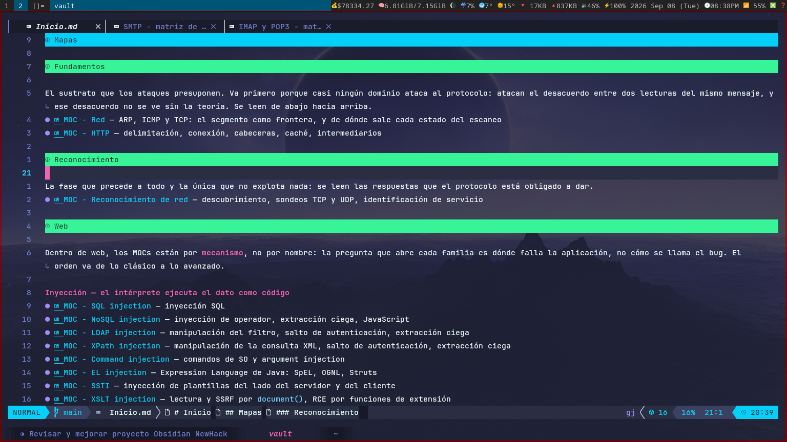

# NewHack

Vault de conocimiento de pentesting: **rojo + azul en el mismo grafo**. No es una colección de comandos sueltos — es un zettelkasten donde cada técnica ofensiva se conecta con el artefacto de log que deja y con la detección que lo caza. La bisagra entre los dos lados es la **telemetría**: el mismo campo `telemetria:` aparece en la nota de ataque y en la de detección, y por ahí se cruzan.

> [!NOTE]
> Repositorio de conocimiento para uso educativo y en engagements autorizados. **Cero datos de cliente**: hostnames, IPs, credenciales y evidencia van a un vault aparte y cifrado, nunca acá (ver `.gitignore`).

## Se lee en nvim, no en Obsidian

El formato es Markdown de Obsidian (wikilinks, callouts, frontmatter), pero **no se consume desde la app de Obsidian**. El cliente es **nvim sobre LazyVim**:

- **[render-markdown.nvim](https://github.com/MeanderingProgrammer/render-markdown.nvim)** + **[obsidian.nvim](https://github.com/obsidianmd/obsidian.nvim)** renderizan wikilinks, callouts, tablas y headings dentro del editor.
- Los colores están tuneados a mano (código en línea celeste, negrita en rosa, callouts por semántica: peligro rojo, atención naranja, tip dorado) para que el Markdown se lea sin salir de la terminal.
- **`900-meta/consultas.py`** reemplaza a Dataview: son consultas cruzadas sobre el grafo (qué tradecraft no tiene detección, qué telemetría nadie consume, alias duplicados, enlaces rotos) que corren desde la terminal, no un plugin.

Por eso el vault no depende de Obsidian para nada de su valor: se navega, se lee y se mantiene entero en nvim.

<!-- Reemplazá esta imagen por una captura real de tu nvim (docs/nvim-render.png). -->


## Por dónde empezar

[**`Inicio.md`**](Inicio.md) es el índice manual de dominios (los "Mapas"). Desde ahí se baja a cada MOC.

- **Los MOCs (`300-mapas/`) son árboles de decisión**, no listas de enlaces: contestan *"tengo esto, ¿qué hago?"* y están ordenados por dependencia, así que sirven de temario.
- **Las matrices (`900-meta/`) son los cheatsheets**: la sintaxis pura (comandos, payloads, flags), indexada desde el MOC de su dominio.
- La regla que separa una cosa de la otra: una nota responde *"cuándo elijo esto en vez de la alternativa"*; si es solo sintaxis, va a una matriz.

## Estructura

| Carpeta | Qué vive ahí |
|---|---|
| `050-teoria/` | Cómo funciona el protocolo que un ataque presupone (DNS, TCP, SMB, HTTP…) |
| `300-mapas/` | MOCs: los árboles de decisión por dominio |
| `400-entidades/` · `450-superficies/` | Herramientas/actores · tecnologías objetivo |
| `500-tecnicas/` | Notas paraguas de taxonomía (CWE, ATT&CK) — sin contenido operativo |
| `550-telemetria/` | Un artefacto de log por nota — **la bisagra** rojo↔azul |
| `600-tradecraft/` | El lado rojo: criterio de ataque, con `opsec`/`probado`/`contexto` |
| `650-detecciones/` | El lado azul: reglas que consumen logs, con `forma`/`ventana` |
| `750-hallazgos/` | Texto reutilizable de informe |
| `900-meta/` | Matrices de referencia (cheatsheets), documentación y `consultas.py` |
| `999-plantillas/` | Plantillas por tipo de nota |

Detalle completo en [`900-meta/Estructura del vault.md`](900-meta/Estructura%20del%20vault.md).

## Consultas cruzadas

```sh
python3 900-meta/consultas.py todo        # las siete de una
python3 900-meta/consultas.py higiene     # frontmatter, enlaces rotos, alias duplicados, MOC sin indexar
python3 900-meta/consultas.py huecos      # telemetría que el rojo emite y ninguna detección azul consume
```

`higiene` corre además en un hook de pre-commit: un frontmatter inválido o un enlace roto frena el commit.

## Principios

- **Una nota por eje, no por combinación.** Las técnicas grandes son intersecciones de ejes ortogonales.
- **El conocimiento rojo caduca.** Toda nota de tradecraft declara `opsec`, `probado` y `contexto`; `probado: nunca` hasta que se corre en laboratorio y funciona.
- **Nada organizado por herramienta.** La herramienta es una entidad enlazada, no una carpeta ni contenido duplicado.
- **Idioma:** si el término aparece literal en una fuente externa (ATT&CK, CWE, Sigma), va en inglés; si lo escribí yo, en español.

Las reglas completas están en [`CLAUDE.md`](CLAUDE.md) y en `900-meta/`.
